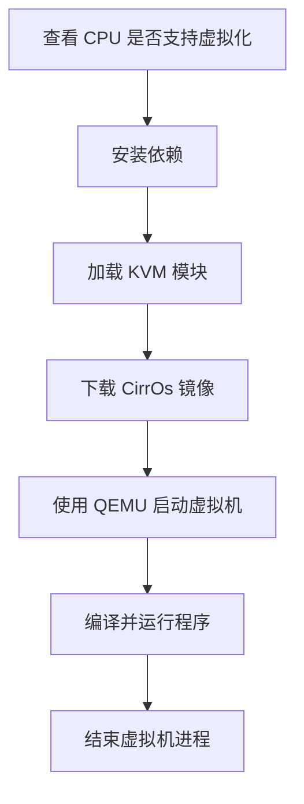

### qemu-kvm源码学习注释

#### 版本：

**linux-4.4.161**

**qemu-2.8.1.1**

```mermaid
graph TD;
    A[查看 CPU 是否支持虚拟化] --> B[安装依赖];
    B --> C[加载 KVM 模块];
    C --> D[下载 CirrOs 镜像];
    D --> E[使用 QEMU 启动虚拟机];
    E --> F[编译并运行程序];
    F --> G[结束虚拟机进程];

```
